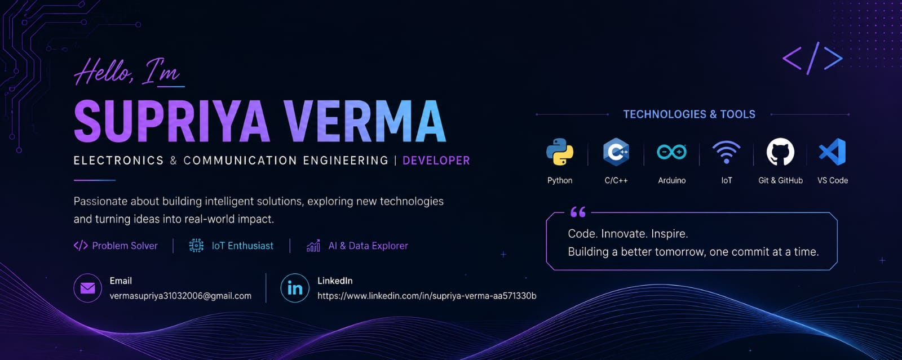

  

  

<h1 align="center">Hi 👋, I'm Supriya Verma</h1>

<h3 align="center">
Electronics & Communication Engineering Student
</h3>

AI • IoT • Embedded Systems • Data Structures & Algorithms

  

# Hi 👋 I'm Supriya Verma

### Electronics & Communication Engineering Student

🎓 GL Bajaj Institute of Technology and Management

💻 Passionate about AI, IoT, Embedded Systems and Data Structures

🌱 Currently learning C++, Python and Machine Learning
## 📫 Connect With Me

- LinkedIn: https://www.linkedin.com/in/supriya-verma-aa571330b
- Email: vermasupriya31032006@gmail.com

## 💻 Tech Stack

- ## 🚀 Featured Projects

- EVisionAI
- SmartSenseHub
- Summer Assignment (DSA)
- AI Website Generator

